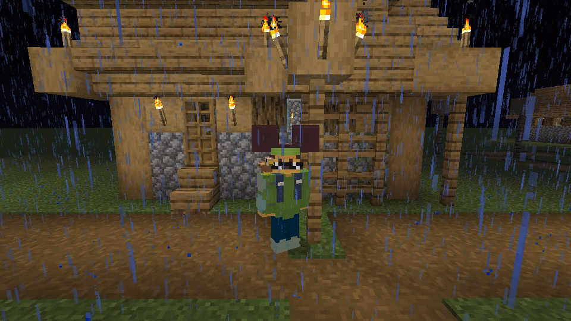

# OpenMCSkins

*This mod is not affiliated with Mojang, Optifine, LabyMod, MinecraftCapes mod, Cloaks+, TLauncher, ely.by, 5ZigReborn,
Mantle or Cosmetica mod*

## What is it?

It's a custom Minecraft skin loader, that's supports custom ears and some cosmetics

### Dependencies

* [Cloth config](https://www.curseforge.com/minecraft/mc-mods/cloth-config)
* [CEM](https://www.curseforge.com/minecraft/mc-mods/custom-entity-models-cem) (OPTIONAL) (required for custom
  Optifine/Cloaks+/Mantle cosmetics)
* [Manningham Mills](https://jitpack.io/com/github/Chocohead/Fabric-ASM/v2.3/Fabric-ASM-v2.3.jar) (OPTIONAL) (required
  for ears)

### Where can this mod download skins and capes from?

* Directly from *anywhere*
* From local storage
* From TLauncher skins system
* From [SimpleHTTP server](./server/) with an API similar to ely.by
* From [Official Mojang Skin System](https://wiki.vg/Mojang_API#UUID_to_Profile_and_Skin.2FCape) via AuthLib
* From [ely.by API](https://docs.ely.by/en/skins-system.html)
* From [Optifine](https://optifine.net/home) cape system
* From [LabyMod](https://www.labymod.net/en) capes system
* From [5ZigReborn](https://5zigreborn.eu/) capes system
* From [Cosmetica](https://cosmetica.cc/) capes system
* From [MinecraftCapes](https://minecraftcapes.net/) capes system
* From [Mantle](https://mantle.gg) capes system
* From [Cloaks+](https://cloaksplus.com/) capes system
* From [Wynntils](https://wynntils.com/) capes system (no custom ears)

### Screenshots

### How to configure this

This mod using a [Cloth config](https://www.curseforge.com/minecraft/mc-mods/cloth-config) for configuration, and you
can access OpenMCSkins options from **"Skin customization..."** options

The host list contains all hosts as strings, like ``{type}`` or ``{type}: {value}``

### How to edit config manually

The mod's configuration is located at **[minecraft game location]/config/openmcskins.yml**. You can edit it with any
text editor (e.g. Notepad++).

### Here are the possible options in the config:

You can find all config options [here](https://github.com/zatrit/openmcskins/wiki/Config-options)

## Why are there errors in README.md? (if any)

Because I translated it with Google Translator because I don't speak English well
